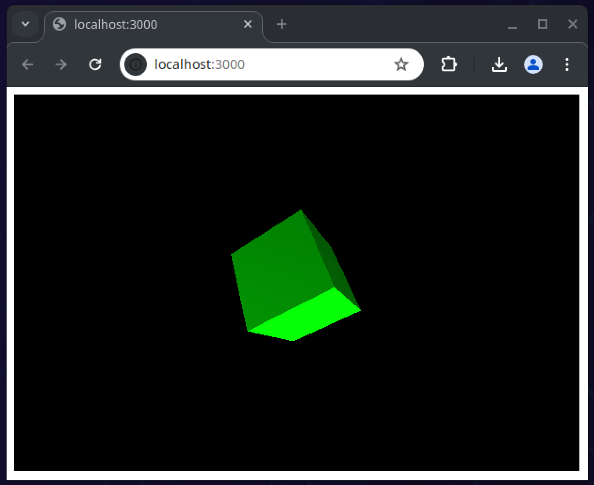

# Server Side Render ThreeJs

This is an example to render Three.js on a server. For advanced rendering it's recommended to install a dedicated GPU on the server.


## Info

Linux: Arch Linux x86_64

GPU: NVIDIA GeForce RTX 3080 Mobile / Max-Q 8GB/16GB

npm version: 10.8.1

node version: 22.3.0

Example code: /src/index.ts

## Setup

``` bash
$ npm install
$ npm run dev
```



